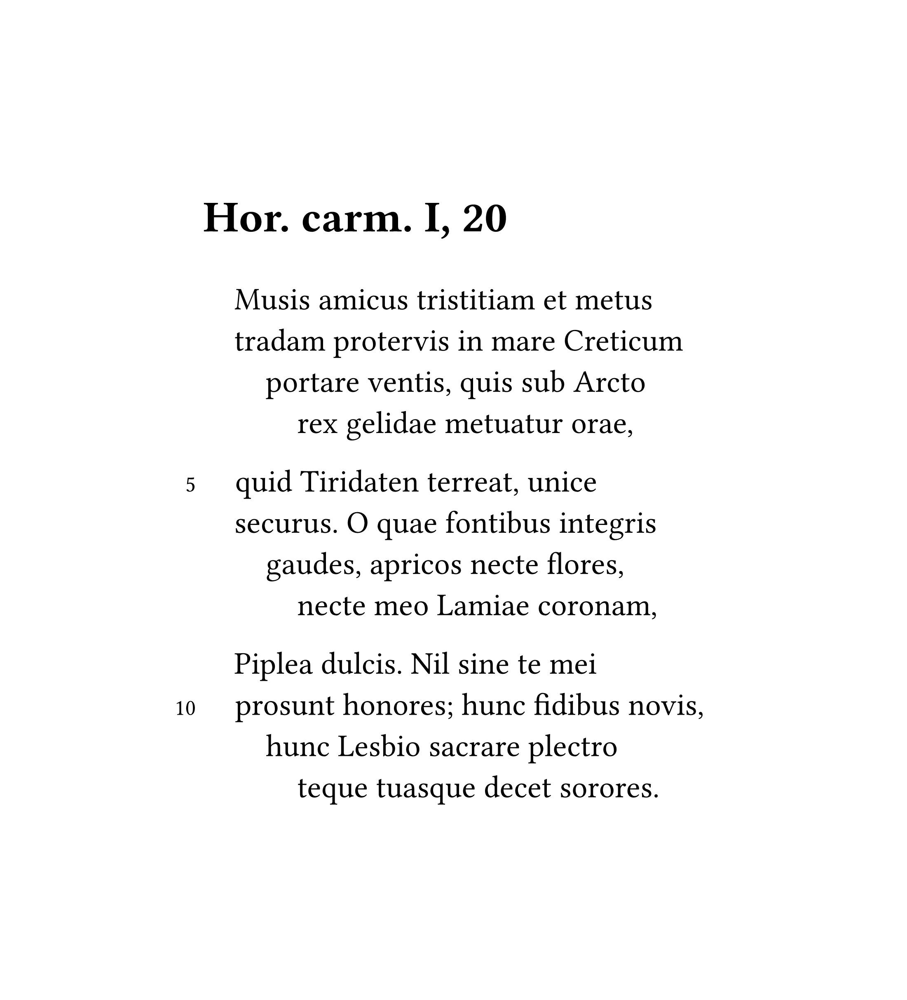

# verseatile

```typst
#import "@preview/verseatile:0.1.0"

#verse-number-modulo.update(5)

#show <poemtitle>: it => heading(level: 1, it)

#poem[Hor. carm. I, 20][

Musis amicus tristitiam et metus \
tradam protervis in mare Creticum \
portare ventis, quis sub Arcto \
rex gelidae metuatur orae,

quid Tiridaten terreat, unice \
securus. O quae fontibus integris \
gaudes, apricos necte flores, \
necte meo Lamiae coronam,

Piplea dulcis. Nil sine te mei \
prosunt honores; hunc fidibus novis, \
hunc Lesbio sacrare plectro \
teque tuasque decet sorores.

][0012]
```

